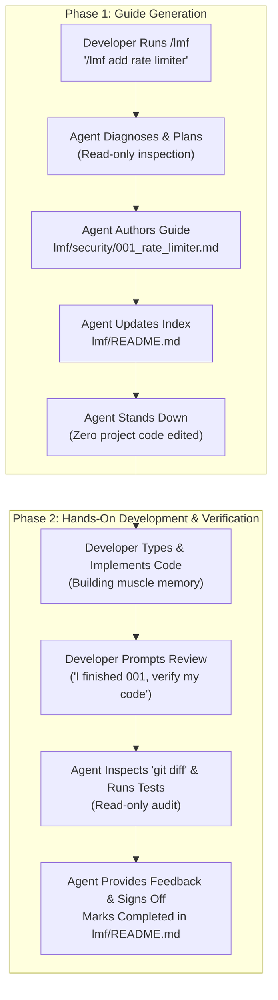

# lmf (Let Me Finish)

> **Own your code again.** Turn autonomous AI coding agents into pair-programming architects that teach you how to build features step-by-step instead of mutating your codebase behind your back.

---

## Quick Start (One-Liner Install)

Run this command inside any project root:

```bash
curl -fsSL https://raw.githubusercontent.com/radenadri/lmf/main/install.sh | bash
```

For global Antigravity installation:

```bash
curl -fsSL https://raw.githubusercontent.com/radenadri/lmf/main/install.sh | bash -s -- --global
```

For Claude Code installation (includes slash command):

```bash
curl -fsSL https://raw.githubusercontent.com/radenadri/lmf/main/install.sh | bash -s -- --claude
```

---

## The Problem: The AI Alienation Crisis

Modern AI coding agents are extraordinarily capable. You prompt them with a feature request, and within seconds, they edit 14 files across 4 directories, run a build, and announce: *"Task completed!"*

Then reality hits:
- **Zero muscle memory:** You did not write a single line.
- **Lost mental model:** You have no idea why a particular abstraction was introduced or how edge cases are handled.
- **Fear of refactoring:** You inherit a codebase that technically works, but feels like third-party legacy code you do not truly own.
- **Silent hallucinations:** Sneaky bugs and misaligned architectural patterns slip past unreviewed diffs.

**`lmf` changes the paradigm.** 

Instead of letting the agent act as an autonomous code mutator, `lmf` binds the agent to the role of **Senior Architect and Technical Mentor**. The agent analyzes the problem, diagnoses root causes, designs the solution, and writes a complete, modular, pedagogical markdown tutorial inside your repository.

**You write the code. You own the code.**

---

## How It Works: The Two-Phase Lifecycle



### 1. Strict Zero-Touch Boundary
When `lmf` is active, the agent is strictly forbidden from modifying, creating, or deleting files outside the `lmf/` directory. It retains read-only tool access to inspect files, types, and run diagnostic test commands, but will **never touch your project source code**.

### 2. Phase 1: Guide Generation
The agent identifies the target module, computes the next sequential index, and drafts a comprehensive, practical tutorial inside `lmf/<module>/<001>_<feature_name>.md`. It also maintains a central table of contents in `lmf/README.md`.

### 3. Phase 2: Review & Verification
Once you have hand-written the code according to the tutorial, ask the agent to verify your work. The agent runs read-only test suites and inspects your `git diff` against the tutorial's verification checklist, offering constructive feedback and signing off on completion.

---

## Using the `/lmf` Slash Command

You can invoke `lmf` either with the `/lmf` slash command or natural language prompts.

### Command Syntax

```text
/lmf <task description or bug details>
```

### Examples

#### Example 1: New Feature Implementation
```text
/lmf add Redis-backed rate limiting to the Express auth router
```
**What the agent does:**
1. Inspects your existing Express router and dependencies.
2. Creates `lmf/auth/001_redis_rate_limiting.md` with exact diffs, imports, and rationale.
3. Updates `lmf/README.md`.
4. Stands down without touching your `src/` directory.

#### Example 2: Bug Diagnosis and Educational Fix
```text
/lmf fix 500 error on Stripe checkout webhook signature verification
```
**What the agent does:**
1. Runs read-only diagnostic tests and inspects webhook payload parsing.
2. Identifies the root cause (such as raw body buffer requirements).
3. Writes `lmf/billing/001_stripe_webhook_signature_fix.md` explaining the cause and how to fix it.
4. Leaves the fix for you to implement and learn.

#### Example 3: Phase 2 Code Review
Once you finish typing the code:
```text
I finished implementing 001_redis_rate_limiting. Can you review my diff and run tests?
```
The agent inspects your changes via `git diff`, runs tests in read-only mode, gives feedback on edge cases, and marks the item `Completed` in `lmf/README.md`.

---

## Directory Organization

All generated tutorials are version-controlled alongside your project in a clean, modular hierarchy:

```
your-project/
├── lmf/
│   ├── README.md                          # Central Table of Contents & Status Tracker
│   ├── auth/
│   │   ├── 001_jwt_cookie_validation.md   # Step-by-step guide
│   │   └── 002_refresh_token_rotation.md
│   └── billing/
│       └── 001_stripe_webhook_idempotency.md
└── src/                                   # Your pristine codebase (untouched by agent)
```

---

## The Production Blueprint

Every tutorial generated by `lmf` follows a structured pedagogical blueprint:

| Section | What it Covers |
| :--- | :--- |
| **1. Problem & Context** | What capability is needed or what bug is occurring. |
| **2. Root Cause & Rationale** | The underlying technical mechanics and why this change is needed. |
| **3. Architecture & Trade-offs** | Patterns selected, alternatives considered, and trade-offs made. |
| **4. Step-by-Step Implementation** | Exact target files, imports, targeted diffs, and 2 to 3 sentence "Why This Works" breakdowns. |
| **5. Verification & Testing** | Concrete shell commands (tests, curl, typecheck) and manual verification checklists. |
| **6. Common Gotchas & Edge Cases** | Subtle traps, off-by-one errors, or concurrency caveats to watch out for. |

---

## Detailed Installation Guide

### Method 1: Google Antigravity

#### Option A: Project-Local (Recommended for Teams)
Installs the skill directly inside your repository so any team member can use it:
```bash
mkdir -p .agents/skills
git clone https://github.com/radenadri/lmf.git .agents/skills/lmf
```

#### Option B: Global (Available Across All Projects)
Installs the skill globally in your user configuration:
```bash
mkdir -p ~/.gemini/config/skills
git clone https://github.com/radenadri/lmf.git ~/.gemini/config/skills/lmf
```

---

### Method 2: Claude Code

#### Step 1: Install the Skill
```bash
mkdir -p .claude/skills
git clone https://github.com/radenadri/lmf.git .claude/skills/lmf
```

#### Step 2: Enable the `/lmf` Slash Command
Copy the included command definition file:
```bash
mkdir -p .claude/commands
cp .claude/skills/lmf/commands/lmf.md .claude/commands/lmf.md
```

Now you can type `/lmf <task>` directly in Claude Code.

---

### Method 3: Cursor, Windsurf, or GitHub Copilot

Add this rule to your `.cursorrules` or `.windsurfrules`:

```markdown
When the user uses the command "/lmf" or mentions "let me finish":
1. Follow the instructions in .agents/skills/lmf/SKILL.md.
2. Never modify codebase files directly.
3. Write guided implementation tutorials into lmf/<module>/<001>_<feature>.md using .agents/skills/lmf/TEMPLATE.md.
4. Update lmf/README.md with status.
```

---

## Natural Language Triggers

In addition to `/lmf`, the skill automatically activates on these phrases:
- `"lmf: <task>"`
- `"let me finish: <task>"`
- `"teach me how to code this: <task>"`
- `"guide my implementation: <task>"`
- `"hands-off mode for <task>"`

---

## License

[MIT](LICENSE) © 2026 radenadri
