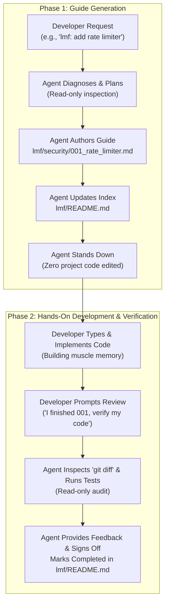

# lmf (Let Me Finish)

> **Own your code again.** Turn autonomous AI agents into pair-programming architects that teach you how to build features step-by-step instead of mutating your codebase behind your back.

---

## The Problem: The AI Alienation Crisis

Modern AI coding agents are extraordinarily capable. You prompt them with a feature request, and within seconds, they edit 14 files across 4 directories, run a build, and announce: *"Task completed!"*

Then reality hits:
- **Zero muscle memory:** You didn't write a single line.
- **Lost mental model:** You have no idea *why* a particular abstraction was introduced or how edge cases are handled.
- **Fear of refactoring:** You inherit a codebase that technically works, but feels like third-party legacy code you don't truly own.
- **Silent hallucinations:** Sneaky bugs and misaligned architectural patterns slip past unreviewed diffs.

**`lmf` changes the paradigm.** 

Instead of letting the agent act as an autonomous code mutator, `lmf` binds the agent to the role of **Senior Architect and Technical Mentor**. The agent analyzes the problem, diagnoses root causes, designs the solution, and writes a complete, modular, pedagogical markdown tutorial inside your repository.

**You write the code. You own the code.**

---

## How It Works: The Two-Phase Lifecycle



### 1. Strict Zero-Touch Boundary
When `lmf` is active, the agent is strictly forbidden from modifying, creating, or deleting files outside the `lmf/` directory. It retains read-only tool access to inspect files, types, and run diagnostic test commands, but will **never touch your project source code**.

### 2. Phase 1: Guide Generation
The agent identifies the target module, computes the next sequential index, and drafts a comprehensive, practical tutorial inside `lmf/<module>/<001>_<feature_name>.md`. It also maintains a central table of contents in `lmf/README.md`.

### 3. Phase 2: Review & Verification
Once you've hand-written the code according to the tutorial, ask the agent to verify your work. The agent runs read-only test suites and inspects your `git diff` against the tutorial's verification checklist, offering constructive feedback and signing off on completion.

---

## Directory Organization

All generated tutorials are version-controlled alongside your project in a clean, modular hierarchy:

```
your-project/
├── lmf/
│   ├── README.md                          # Central Table of Contents & Status Tracker
│   ├── auth/
│   │   ├── 001_jwt_cookie_validation.md   # Step-by-step guide
│   │   └── 002_refresh_token_rotation.md
│   └── billing/
│       └── 001_stripe_webhook_idempotency.md
└── src/                                   # Your pristine codebase (untouched by agent)
```

---

## The Production Blueprint

Every tutorial generated by `lmf` follows a structured pedagogical blueprint:

| Section | What it Covers |
| :--- | :--- |
| **1. Problem & Context** | What capability is needed or what bug is occurring. |
| **2. Root Cause & Rationale** | The underlying technical mechanics and *why* this change is needed. |
| **3. Architecture & Trade-offs** | Patterns selected, alternatives considered, and trade-offs made. |
| **4. Step-by-Step Implementation** | Exact target files, imports, targeted diffs, and 2–3 sentence "Why This Works" breakdowns. |
| **5. Verification & Testing** | Concrete shell commands (tests, curl, typecheck) and manual verification checklists. |
| **6. Common Gotchas & Edge Cases** | Subtle traps, off-by-one errors, or concurrency caveats to watch out for. |

---

## Installation

### For Google Antigravity

Clone or copy `lmf` into your project's `.agents/skills/` directory (or globally in `~/.gemini/config/skills/`):

```bash
# Project-local installation
mkdir -p .agents/skills
git clone https://github.com/radenadri/lmf.git .agents/skills/lmf

# Or global installation
git clone https://github.com/radenadri/lmf.git ~/.gemini/config/skills/lmf
```

### For Claude Code

Place the skill into your project's `.claude/skills/` or reference `SKILL.md` in your project's instructions:

```bash
mkdir -p .claude/skills
git clone https://github.com/radenadri/lmf.git .claude/skills/lmf
```

### For Cursor, Windsurf, or Copilot

Add a rule pointing to `SKILL.md` in your `.cursorrules` or `.windsurfrules`:

```markdown
When the user uses the prefix "lmf:" or asks to "let me finish":
1. Follow the guidelines in .agents/skills/lmf/SKILL.md.
2. Never modify codebase files directly.
3. Write guided implementation tutorials into lmf/<module>/<001>_<feature>.md.
```

---

## Usage Examples

### 1. Generating an Implementation Guide

Prefix your feature or bug fix prompt with `lmf:` or `"let me finish"`:

```text
lmf: We need to add an in-memory TTL caching utility to our API service.
```

```text
let me finish: How do I handle Stripe webhook idempotency with Redis?
```

**Agent Output:**
> *I've analyzed the existing caching architecture and created the implementation guide at `lmf/cache/001_in_memory_ttl_cache.md`.*  
> *Table of contents updated in `lmf/README.md`. Your source code has not been modified. Follow the guide to implement the cache, and let me know when you're ready for review!*

---

### 2. Requesting Review & Verification

Once you've implemented the code yourself, invite the agent back in:

```text
I finished implementing 001_in_memory_ttl_cache. Can you check my code and verify?
```

**Agent Response:**
> *Running test suite and inspecting your diff...*  
> - *`src/lib/cache.ts`: Cache expiration logic correctly handles timer eviction.*  
> - *`src/lib/cache.test.ts`: All 5 unit tests passing.*  
> - *Notice: In line 42, consider handling potential undefined key lookups explicitly.*  
> *Status marked as `Completed` in `lmf/README.md`.*

---

## License

[MIT](LICENSE) © 2026 radenadri
